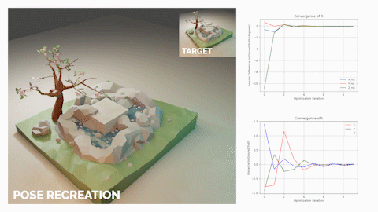

# Reimplementation of 6D Dynamic Camera Relocalization from Single Reference Image



This project is a simulated implementation of the paper [6D Dynamic Camera Relocalization from Single Reference Image](https://www.cv-foundation.org/openaccess/content_cvpr_2016/papers/Feng_6D_Dynamic_Camera_CVPR_2016_paper.pdf) by Wei Feng, Fei-Peng Tian, Qian Zhang and Jizhou Sun. It was created for the class ENGN 2560: Computer Vision at Brown University.

## Running the Project

The settings for different pose estimation scenarios are found in `.json` files whose format is specified in `SettingsLoader.py`. Several examples can be found in the `blender-scenes` folder. To run pose estimation with the forest scene, for example, do the following:

```
python3 -m source.scripts.camera_recreate_pose data/blender-scenes/forest.json
```

## Animating the Results

The script `animate_pose_recreation.py` can be used to export interpolated graphs and frames for use programs like After Effects. To animate a settings `.json` file, first make sure you've run the main pose estimation script. Then, do the following:

```
python3 -m source.scripts.animate_pose_recreation data/blender-scenes/forest.json
```

## Project Setup

To set up this project's virtual environment, navigate to the root directory (the one this file is in) and run `python3 -m venv venv` to create a virtual environment. Then, do `source venv/bin/activate` on MacOS/Linux or run `venv\Scripts\activate` on Windows to enter this virtual environment. Finally, do `pip3 install -r requirements.txt` to install this project's dependencies. Make sure you're in the project's virtual environment when trying to run any of the project files.

The recommended way to edit and run this project is through VS Code. If you're using VS Code, you can use launch configurations in `.vscode/launch.json` to run common tasks, and linting will happen automatically. If not, you should run scripts as modules from the root directory (e.g. to run `camera_render.py`, you would do `python3 -m source.scripts.camera_render`).

## Acknowledgements

We thank the creators of the many Blender scenes we used:

- The scene `spring.blend` was created by Free3D user [Nerman Turkić](https://free3d.com/user/nerman3).
- The scene `forest.blend` was created by CGTrader user [LeylaRanjbar](https://www.cgtrader.com/boxgroup).
- The scene `tram.blend` is a Blender demo scene created by [Dedouze (Andry Rasoahaingo)](https://dedouze.com/).
- The scene `bilbo.blend` was created by CGTrader user [xmarn](https://www.cgtrader.com/xmarn).
